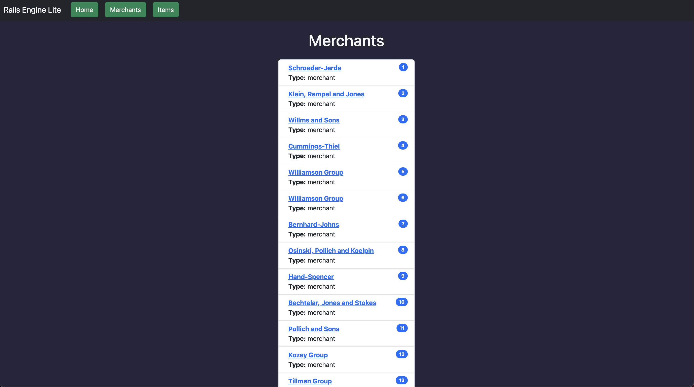
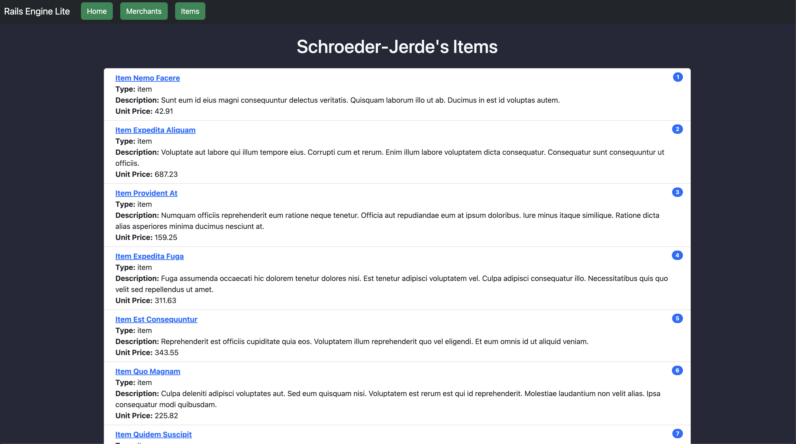
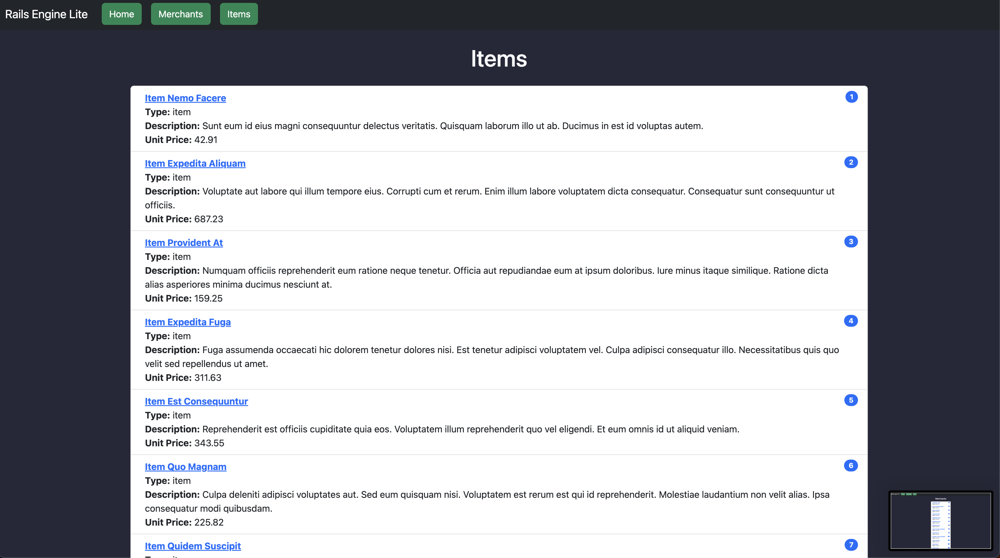
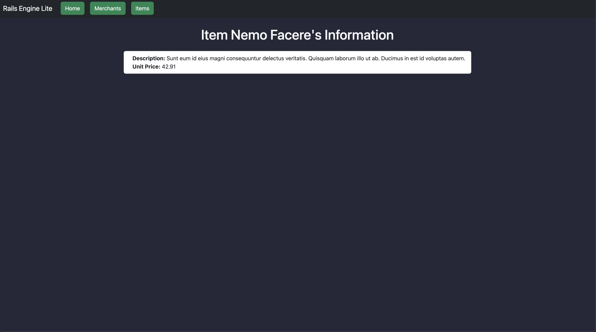

  

<h1>Info</h1>

 This project was created to give users access to several different API endpoints relating to Merchants, Items, and their show pages.

## About the Project
This Front-end application is a basic setup showing the capabilities of SOA so the functionality is currently limited to merchant index page, item index page, and their show pages.

This application also has a backend API it is consuming as a service. That is located [here](https://github.com/Dominicod/rails-engine-lite/)

## Built With

## Gems

## Set Up
- Clone this repo
- Change puma config port from 3000, to 5000.
- `bundle install`
- `rails s`

Visit the [back-end application](https://github.com/Dominicod/rails-engine-lite/) to begin back-end setup.

## Database Creation
- `rails db:{create}`

## Deployment
- `rails s`

## Testing Instructions

- Clone this repo
- in terminal (apple or integrated)
    * bundle install
    * bundle exec rspec

## End Points

### Merchants Index

`http://localhost:5000/merchants`

### Merchant Show

`http://localhost:5000/merchants/1`

(This end point shows all of the Merchants Items)

### Items Index

`http://localhost:5000/items`

### Item Show

`http://localhost:5000/items/4`

## Contributions

🔥 Github: <a href="https://github.com/Dominicod">https://github.com/Dominicod</a> LinkedIn: <a href="https://www.linkedin.com/in/dominic-odonnell/">https://www.linkedin.com/in/dominic-odonnell/</a>  

